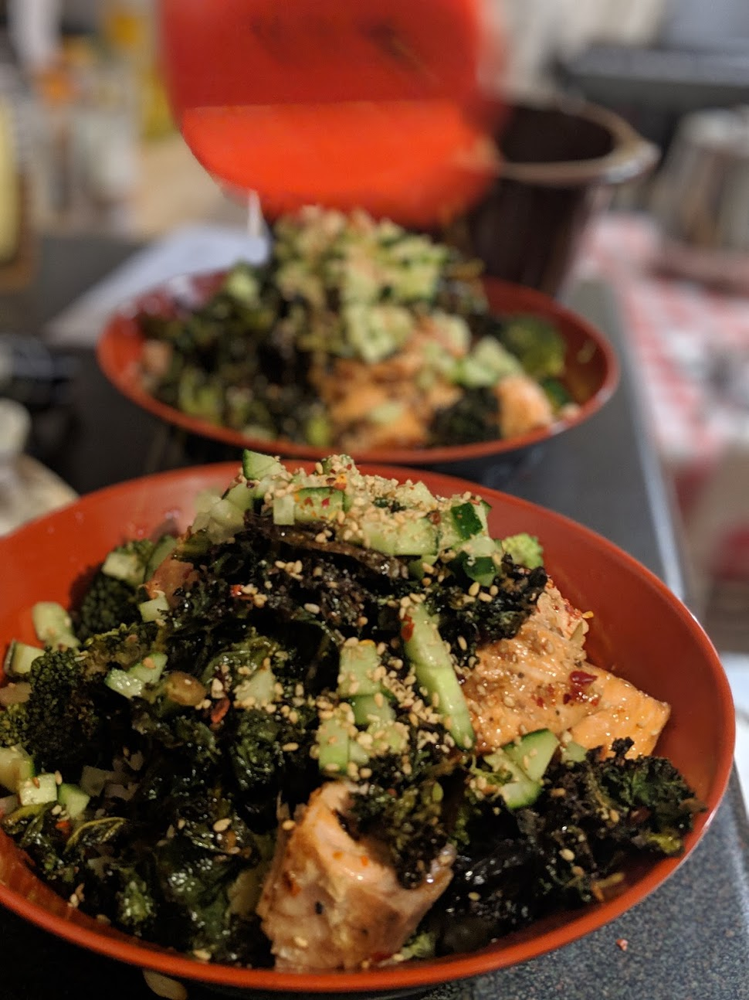
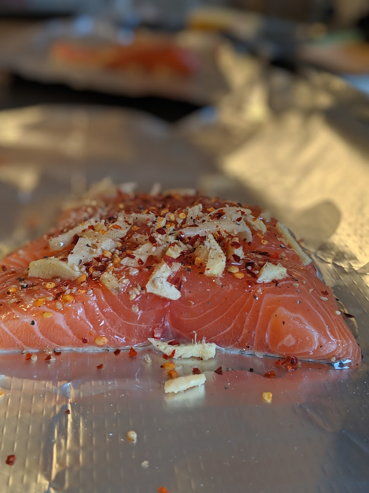
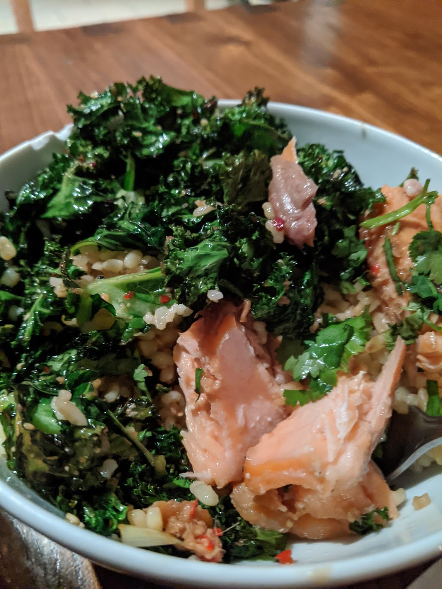

# Asian Salmon and bulgar wheat with crispy kale

* 2 Quality salmon steaks
* 600g large bulgar wheat
* 1/2 bags kale
* 3 teaspoon Dark soy
* 1 teaspoon fish sauce
* 2 tablespoon Light soy 
* 1.5 tablespoon clear/golden honey
* 1 Fresh chili (or more for extra spice) (finely chopped)
* 1 stick lemongrass
* 2 tablespoon grated fresh ginger
* Bunch fresh coriander
* 2 lemons juice
* Olive oil
* Zest from one lemon

Mix the dark/light soy with the honey and the fish sauce. Add the fresh chilli ginger and large chunks of the lemongrass sticks. Note you can multiply up this sauce quantity (better to always have more...) Leave this on the side, make sure its mixed well.

Take the salmon steaks, take a piece of tin foil for each salmon steak, large enough to very easily wrap each salmon. Make little 'boats' around the salmons from the tin foil, and pour/share out the sauce between each salmon/boat. The salmon should be sitting in a nice amount of sticky sauce and a good amount on top. You can control how the sauce flows around the salmon by how tightly you pull the tin foil boats close to the salmon. Loosely close the tin foil above the salmon so that there is space in side, the foil is closed up. Leave for an hour in the fridge.

Boil a kettle and make the bulgar wheat. With bulgar I tend to put the bulgar in a glass bowl, pour in the bowling water so the bulgar is covered by a good couple of centimetres, cover in a tea towel and leave for like 20 minutes.

Preheat oven to 180C. 

Take the salmon out of the fridge and leave for 15 minutes to reach room temperature.

Place the salmon packages in the oven, they will take around 17 minutes to cook depending on your oven, however if you can use a temperature guage, you are looking for the center to be about 60 degrees C however, or the record i tend to do this by time and then take one out and have a look for that slightly pale, flakey texture. Take them out and let them rest for a few minutes. They will still cook slightly so be aware of that when taking them out.

Place the kale on an oven tray, shake some salt, chilli flakes, olive oil and one lemon's juice, over, and put in the hot oven. It won't take long to go crispy, give it a check, and take it out before it starts to burn. 

In the meantime uncover your bulgar, which should have absorbed all the water. Add salt, pepper, 1 lemon's juice, lemon zest and a good glug of olive oil. Mix it all up and taste it. Add anything you feel it is missing, and then add the chopped corriander. Mix again and cover. The bulgar is ready to serve.

Unwrap the salmon - keep the sauce!

Serve by putting some bulgar in a bowl, place the salmon steak on top, spoon a bit of sauce over the steak letting it run into the bulgar slightly, and place some kale to the side. Add extra sauce if you would like it.

I like to shake some sesame seeds through the kale before serving it

As the picture shows, I like to flake the salmon up

