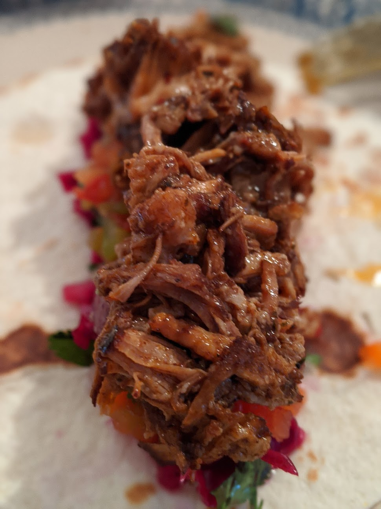
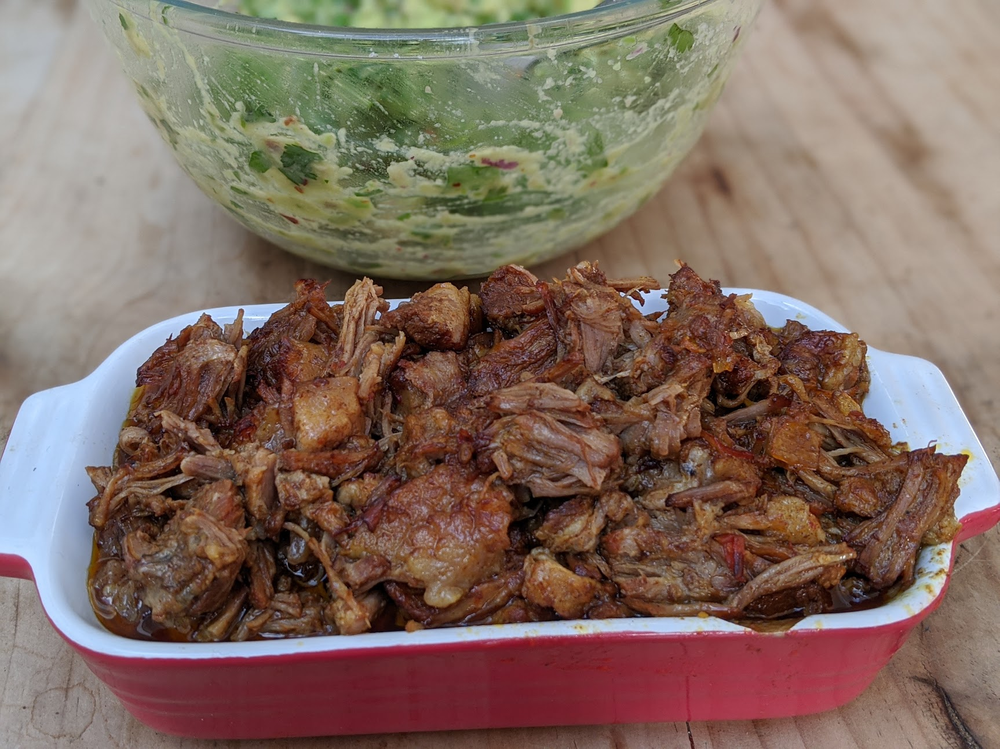
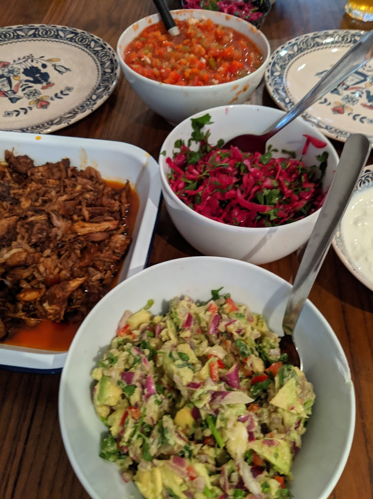
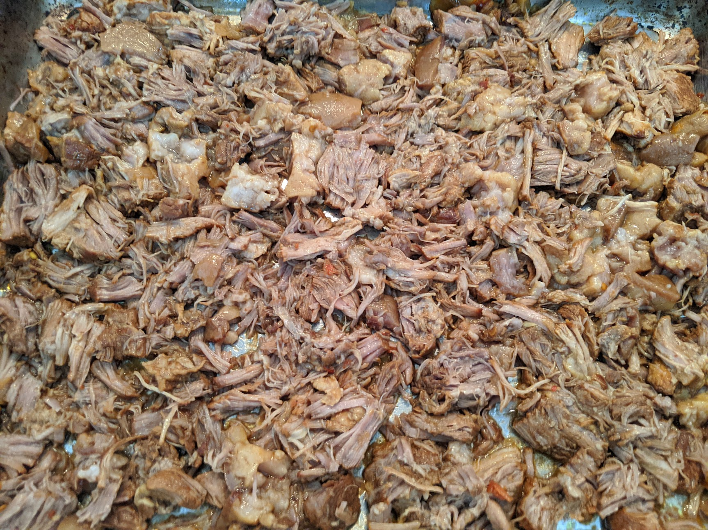
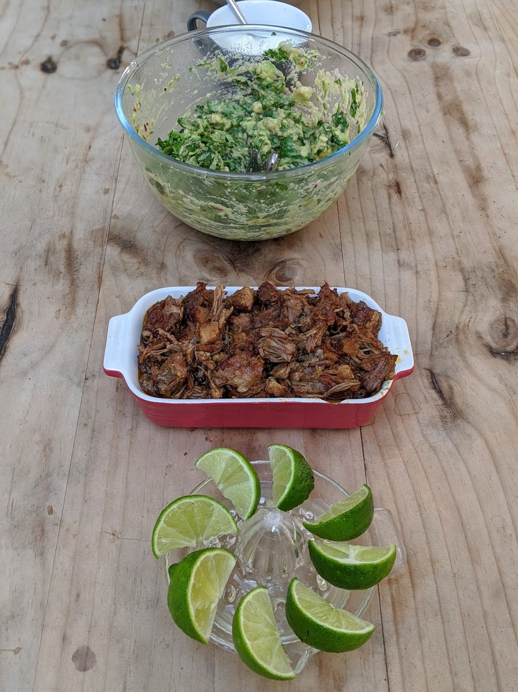

# Instant Pot Pork Carnitas

## Salsa ingredients

- tomatoes
- green/red peppers
- jalapenos
- red onion
- garlic

roast the lot, chunk in blender with salt and lime, adjust to taste. Leave atleast an hour to rest. 
The roasting will affect the bitterness

## Guacamole 

* 3 avacado
* 1/2 shallot
* 1/2 green onion
* 1/4 onion
* 2 garlic
* 1/2 can ro-tel with green chilies
* 1 tsp olive oil
* sprinkle of red peppers
* handful cilantro
* salt to taste 

## Home made soft tacos

* Maze flour (masa harina) (250g)
* Warm/hot water (375ml)
* Glug of Vegetable oil
* Salt (good tsp)

* Mix and leave to rest for at least 15 minutes. Should hold together as a single soft ball
* Use taco press and press into small flats
* Seperate each with baking parchment and dry fry

## mexican coleslaw 

 * Shredded carrot
 * Red cabbage
 * Corriander
 * Red onion
 * lime
 * white vinegar

Mix together to taste

## Sliced sharp Onions

* Onions
* Salt
* Sugar
* Cayenne
* Vinegar
* Lime Juice

Mix together to taste

## The Pork:

* Pork Shoulder 

### Rub:

3 tbsp smoked paprika
1.5 tbsp garlic powder
1 tsp ginger powder
1 tbsp chipotle powder
2 tbsp Kosher salt
2 tbsp raw can sugar
1/2 tsp dry sage

Slice up the pork into 1.5-2 inch cubes. Coat all pieces in the dry rub

## Liquid
* 
* 2 tsp liquid smoke
* 2 limes juiced (keep half a lime skin)
* 2 oranges juiced 3/4 cup of orange juice (keep half an orange skin)
* 1 onion roughly chopped
* 5 garlic cloves roughly chopped
* 1 serrano pepper roughly chopped
* 1 tsp black pepper

Throw all in the instant pot, followed by the pork, partially submerged and then throw the orange and lime skin in too

Cook on high pressure for 45 minutes. Leave to slow release for 15 minutes. 
Remove the pork chunks gently and shred them. Place on a baking tray and cover in the juices so just submerged. Put under the grill for 10-15 minutes to caremelise the juices. 

Serve with creme fresh/sour cream

