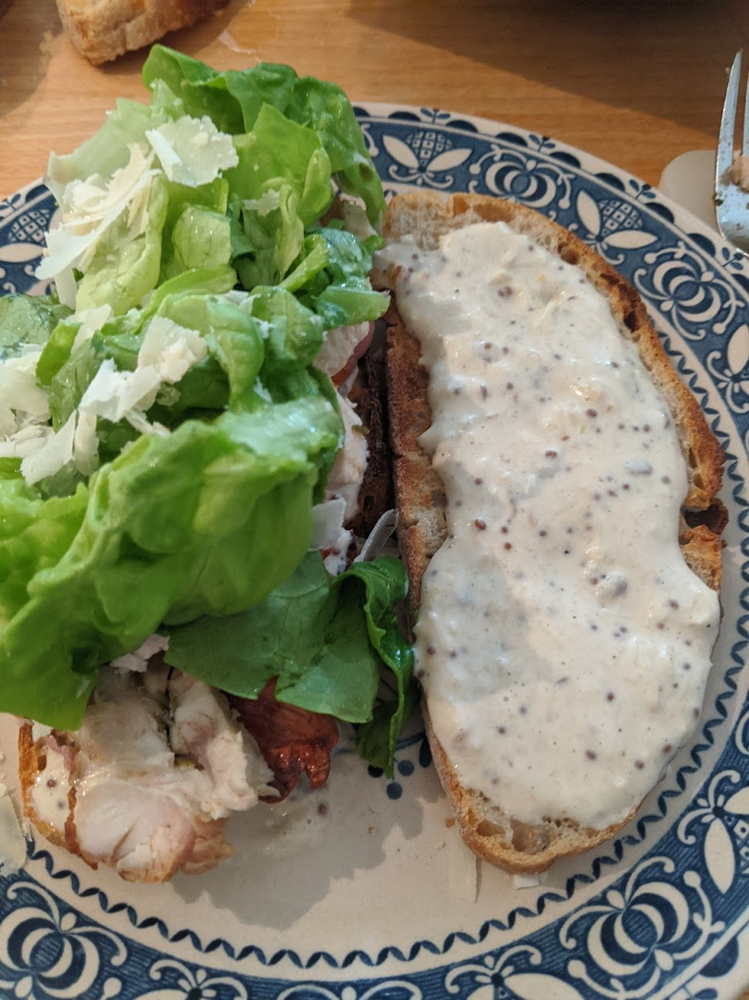

# Chicken Caesar Sandwich

* Sour dough bread, sliced
* Gem lettuce, broken up
* Bacon, unsmoked, oven cooked before crisp (about 20 minutes at 180)
* Chicken, mix of thigh and breast, preferably rotisseried and infused with garlic and herb
* Mayonaise
* Anchovies (2)
* Garlic cloves (1 - 2)
* Worcester sauce (table spoon)
* Dijon mustard (small table spoon)
* Salt (pinch)
* Pepper (good grind)
* Parmesan (grated)

To be clear, whenever I rotisserie deboned chicken, I always make sure I have enough to make this sandwich the next day 

Mash the anchovies, crush the garlic cloves, mix well with the back of a fork in a bowl. Throw in the Worcester sauce and the Dijon mustard. Add the salt and pepper. Mix very well. Add a good amount of mayonaise and keep adding while tasting. Its a taste preference. The sauce should be runny. Add the grated parmesan to the sauce and mix to a nice paste.

Assumming your chicken and bacon are cooked, gently toast the bread, cover a piece of bread with the sauce, add the chicken add the bacon add the lettuce, add sauce to the other piece of bread, and press the sandwich closed. Delicious
