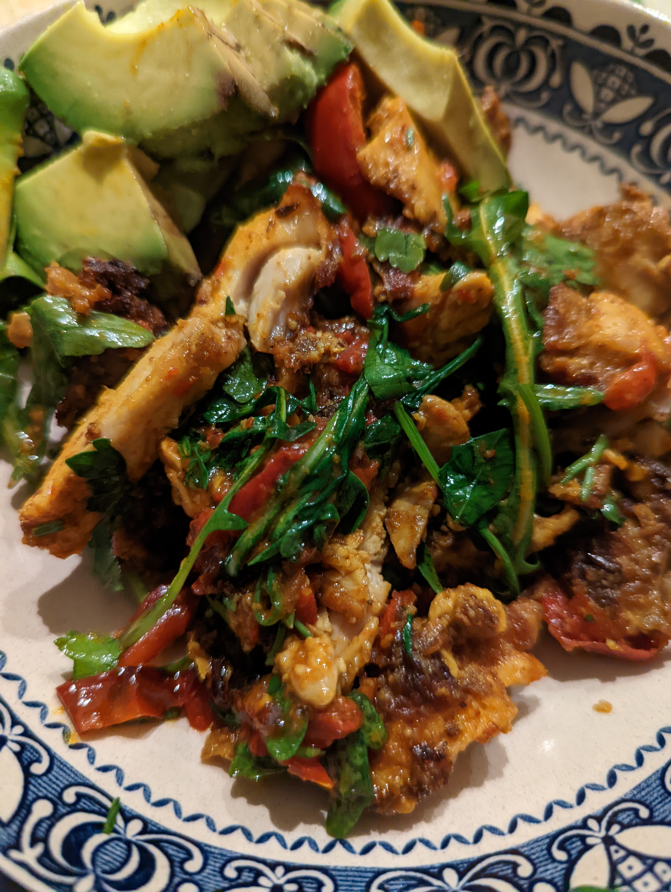
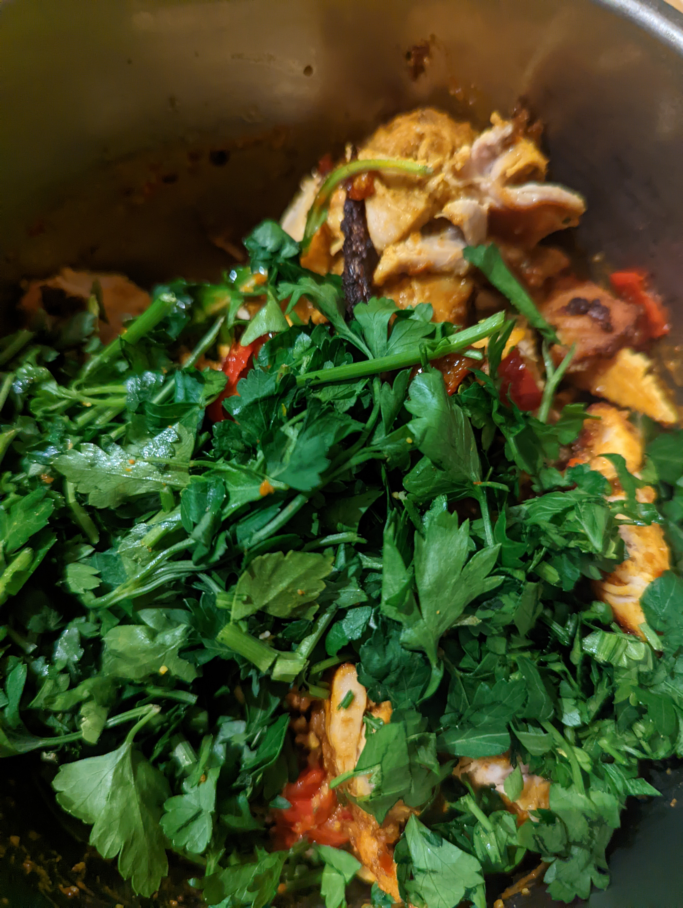

# Chicken Tikka Salad

This is my favourite "healthy" meal to cook. It's so easy, it's delicious and you can eat unlimited amounts and not worry about having too many calories. Eat this in variations over a week and you will watch the belly fat dissapear.

## Ingredients

* Chicken thights (boneless). The rest of the recipe is for 4, however cook up 2 days worth in one go (8-10) and live off it.
* Red pepper
* 0.5-1 Avocado (optional)
* Celery sticks (3)
* Rocket (or something similar, perhaps spinach?)
* Optional - further green vegetables - tender stem brocoli works
* Olive oil
* Chilli flakes
* Fresh chilli (optional)
* Favourite hot sauce
* Patak's Tikka paste (not sauce)
* Parsley (or coriander, try whichever)
* Salt
* Pepper
* Garlic powder (not garlic salt)
* Optional soy sauce, good dash

## Method

* Sprinkle chicken well with salt, pepper and garlic powder. Leave the chicken breasts for a bit on the side to 'soak up' the salt
* Slice up the red pepper into thin strips, then cut in half
* Slice [half] the avocado
* Slice the fresh chilli if you want it hotter
* Slice the [optional] extra green vegetables into 'salad style pieces' (with tender stem I usually slice vertically up the stems at a slight angle, to make thin, but longer pieces)
* Slice the herb(s) up into small piece
* Coat the chicken thighs in a good spook of pataks paste - you can add the soy at this stage if you like to give a bit of umami flavour
* Put the pepper slithers into an oven tray
* Other veg including celery on top of the peppers
* Place the chicken thighs on top
* Slather your favourite hot sauce over the lot to your 'spicy' liking. Remember cooked it will be weaker
* Dash some dried chillis over the top
* If you want the fresh heat, add the fresh chilli slices
* Oven cook at 185 for around 40-45 minutes. (73 degree C internal temperature of chicken)
* Take out oven, check chicken is cooked, slice the thighs into thin strips

* Mix the peppers celery etc, the chicken, the rocket and the herbs in a bowl and mix everything well
* Serve in a bowl with the avocado
* Eat as regularly as you are hungry, serve smaller bowls more frequently.

vary it as you like, in this one I didn't mix the rocket

