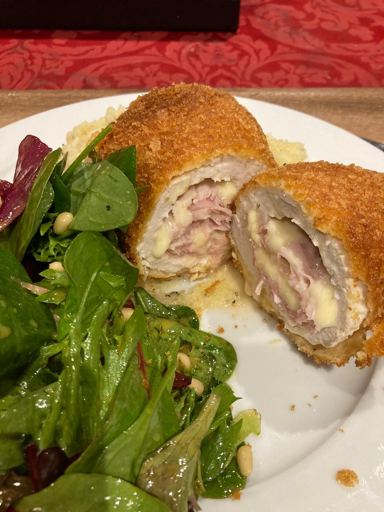
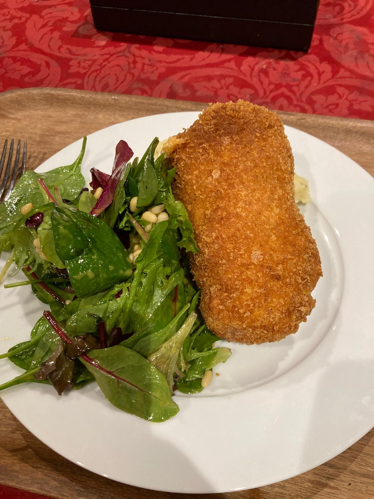

# Cordon Bleu

Requires a deep fryer for perfect results

## Ingredients

* 1 large chicken breast
* good quality cooked ham
* gruyere swiss cheese
* panko bread crumbs
* corn flour
* salt
* pepper
* garlic powder
* eggs

Lay out three bowls, first one corn flour/salt/pepper/garlic powder, second cracked/whisked eggs, third pank bread crumbs. Salt/pepper garlic to taste.

Cover the chicken breast in clingfilm and with a kitchen mallet bash it down. Don't bash so hard it breaks the meat completely or goes through the clingfilm. It should take a few minutes to get the chicken breast to just over half a cm thick.
On one edge place ham and cheese layered - about 1 cm from the edge, covering about a third of the breast. Remember you need to be able to fold it over and close the ends. Fold the chicken ends in and roll tightly, making sure no cheese/ham is exposed. Wrap in cling film tightly so its in a cylinder. Fridge for 20 minutes or so but longer if you like.
Unwrap, and carefully roll in the flour mix, dip and coat in the eggs and then the panko. For extreme crispiness dip again in eggs and again in panko.

In 170 degree C oil, cook for 7 minutes deep fried/submerged rolling it every so often as the underside will cook slightly faster than the top., remove and place on kitchen towel, covered, to soak up excess oil. Let the surface dry somewaht.
Increase heat to 190 degrees C and cook for 2 more minutes.
remove the oil again with kitchen paper and serve.

x