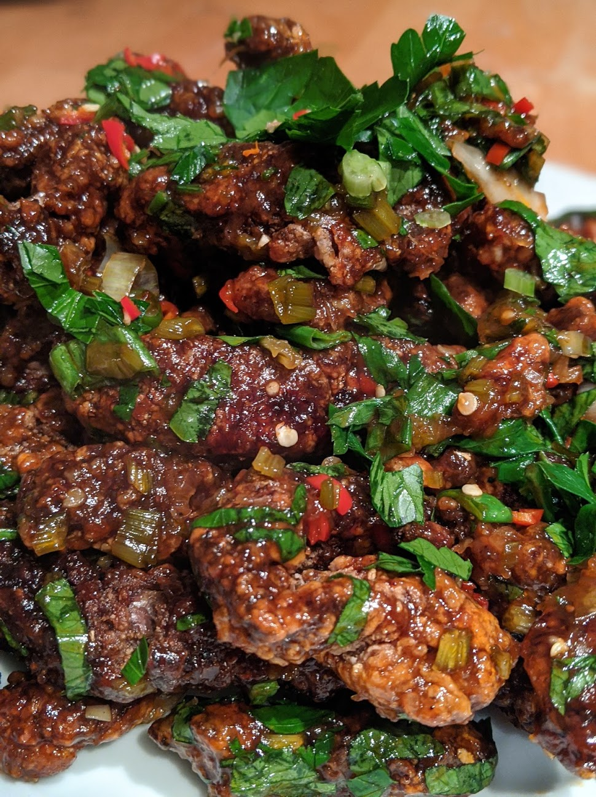

# Crispy Chilli Shredded Beef

In theory this is my favourite dish. However so many places cheap out on the beef that its not as good as it could be. This is how it should be.

* Rump steak 200g
* 400g Cornflour
* salt
* Black pepper
* Nice chunk of fresh ginger
* 3 Garlic cloves
* 2 Birds eye chillis
* Bunch Corriander (with stalks)
* Vegetable oil (for frying)
* 1 tspn Sesame oil
* 1 tspn Granulated sugar
* 2 tblspn Light Soy sauce
* 1 tblspn Dark Soy sauce
* 3 tblspn Tomato ketchup
* 6 tblspn Black rice vinegar
* 4 tblspn honey
* 1 egg

## Mariade the beef

Mix together the sesame oil, the sugar, the light soy sauce. Slice the beef into nice chunky pieces (depending on how you like it). Add the marinade ingredients to the beef, and also crack the egg in. Mix it all together thoroughly. Make sure all the beef is well and evenly coated. Leave on the side for a bit.

## Cooking flavours

Peel and dice the ginger and garlic. Slice the chillis into rings. Seperate the corriander stalks from the leaves and slice the stalks up and add to the garlic and ginger mix. Put the leaves to one side.

## Sauce for the cripsy beef

Mix together the dark soy, the ketchup, the rice vinegar and the honey. Leave this in a bowl, this will be cooked with the beef once the beef has been fried.

## Coat the beef

Add the salt and pepper to the cornflour. The key here is to have way to much cornflour. You will want to do this in a nice big bowl. To this add the marinaded beef. Now with your hands have some patience. As long as you have ample cornflour, keep mixing the cornflour into the beef. It will be clumpy but once its all very well coated the beef will seperate from each other and be fantastically coated in the flour. You can now shake each piece of beef off so there isn't any excess flour. The beef is now ready for frying

## Frying

Get a wok of oil hot to 180 degrees C. You can check this with a chopstick, put the end of a chopstick in the oil, if it bubbles and fizzes you are ready. Hopefully you have a birds nest to make adding and removing the beef easier, but otherwise gently, add the beef to the oil. Don't overfill otherwise the temperature will drop too low, you can easily do this in batches. After 30 seconds, remove the beef and drain on some kitchen paper. Repeat with any uncooked beef. Now you are going to do it all again, but this time leaving the beef for 2/3 minutes in the oil. Doing this process twice will get you extra crispy beef. Drain and leave on kitchen paper.

## Coating and serving

Now, in a clean wok, heat a couple of tablespoons of oil and get it smoking hot. Add to this the ginger/garlic/corriander stem mix lower the heat and stirfry for 30 seconds. Pour the sauce mixture into the wok at this point and get it nice and hot and it will start to thicken - get it bubbling. At this point add your dried, crispy beef to the wok and toss everything together. Be careful, the sauce is hot and sticky and therefore will burn if you touch it at this stage. Once mixed thoroughly, remove from the heat, and add half the corriander leaves. Toss once more.

Pour the lot into a bowl and top with any left over corriander leaves and any chilli rings left for garnish.
