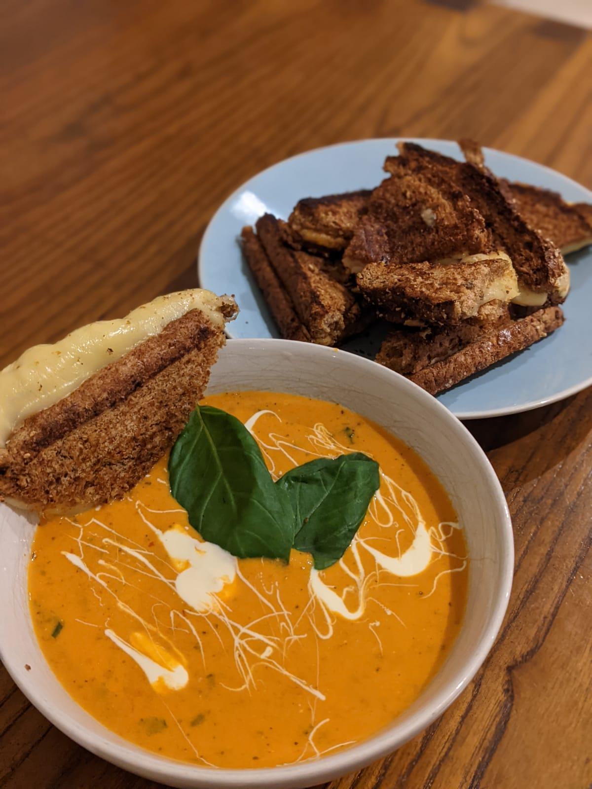

# Instant Pot Tomato Soup and Cheese Toasties

* 3 Can whole/peeled tomatos
* 2 cloves garlic (crushed)
* 1 whole onion
* dried chilli flakes
* heavy/double cream (300ml)
* 0.5 litres of chicken stock
* 2 teaspoon salt
* 2 teaspoon honey
* 1 tsp of some combination of dried [basil, oregano, rosemary, thyme, garlic powder, sage, or coriander] - often stores will have "italian seasoning" which will be a combination of these ready to go
* glug of olive oil
* good slices of butter
* black pepper
* fresh basil (divide in two, keep some leaves whole for decoration)
* delicious quality bread slices (although not a sour dough as the holes are too large)
* A range of strong cheeses (mature chedder, gouda, mexican chilli cheddar, monteray jack or others). Preferable grated but sliced works well too.
* dijon mustard

### Notes

* Before starting here, quality of ingredients makes a huge difference, e.g home brand tinned tomatoes are just going to be lowering the quality of this soup.

* You will need an immersion blender, smoothy maker or another blender of some sort but immersion best for soups

## Instructions

* Put the instant pot on sauté mode, low heat. Add a slice of butter and pour enough olive oil to cover the slice of butter. Let it melt slowly
* Roughly chop the onion and seperate the layers. Add to the instant pot. You want to wait about 5 minutes, stirring every so often so they go translucent but don't go brown. You don't want them leaving caremalised residue on the bottom of the instant pot (if they do, you will want to deglaize the pot before the next stages).
* Add a good amount of black pepper and some salt to the instant pot
* Add the dried herb combination
* Add the crushed garlic
* Add dried chilli flakes
* Mix for 1 minute and turn off saute mode
* Add the stock to the instant pot
* Using a pan (I like to use a wok) pour all the tins of tomatoes in, and with a knife/wooden spoon/your hands, break the peeled tomatoes (dont worry about chopping up finely). Throw into the instant pot. Don't however mix the tomatoes in (better to not have them touching the bottom of the pan).
* Set the instant pot to high pressure mode for 8 minutes. Turn on the warming mode aswell
* Slow release with warming mode on for 8 minutes. After that release the pressure and open.
* Blend all the ingredients in the instant pot at this stage and then turn back on to sauté mode - this time medium heat. Let it bubble/simmer for 8 minutes, check it and stirring every so often. Big irregular bubbles better than boiling furiously.
* Add 250ml of the thick cream and the honey and stir it in. Allow to bubble for another minute and then turn off the instant pot.
* Add half the fresh basil, chopped up and let the soup rest (it will start to thicken) for 5 minutes or so.

* When ready to serve, ladle into a bowl, with a teaspoon take a spoon of the double cream and shake it over the surface to give a Jackson Pollock design. Add two whole fresh basil leaves. 

## Toasties

* During the time that the instant pot is under high pressure, this is the time to [lightly] toast your bread and slice your cheese(s).
* While waiting butter the toast and prepare a large frying pan with a good amount of butter and olive oil (don't turn it on yet).
* Construct the toasties putting cheese on both sides of the sandwich and close together. If you like dijon mustard add that now under the cheese and on the butter.
* Turn your oven to 180 degrees C, let it warm up

* During the second 8 minute wait for the slow release, turn your frying pan on a medium/high heat, let the butter melt and the oil get hot. Add the sandwiches so the outside of the toast goes golden brown. All the while with a spatula be pressing down on the sandwich (it will hold together much better as a result). Once that side is golden brown flip and repeat. This process does use quite a lot of butter but its delicious. You can skip the whole frying pan stage if you like and just toast the bread for longer if you prefer health over taste, but c'mon its a cheese toastie :)
* Once golden on both sides, put on an oven tray and stick in the oven. Monitor for the cheese melting to almost liquidy deliciousness.
* Try and time removing them from oven with adding the fresh basil to the soup.
* Once they are done, cut into triangles.

