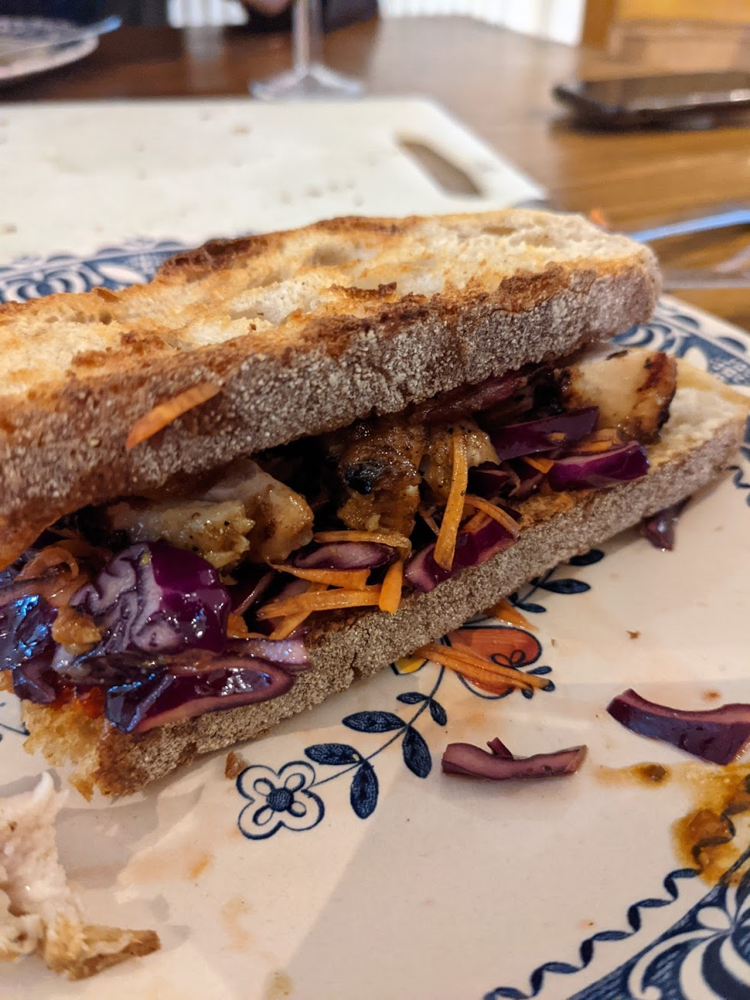

# Jerk Chicken Sandwich

## Chicken

Organic thighs. Boneless/skinless best for sandwiches. For anything else any dark chicken meat is good.

## Jerk Paste

* Scotch Bonnet (1 for mild, 2/3/4 for hotter...)
* Spring Onions (4)
* Garlic cloves (2)
* Fresh Ginger, scrubbed and grated/chopped (1 inch)
* Dried Thyme (1 teaspoon)
* Vegetable Oil (2 tablespoons)
* White Vinegar (2 tablespoons)
* Rum (2 tablespoons)
* Fresh Orange Juice (1 orange)
* Lime Juice (2 limes)
* Brown Sugar (3 tablespoons)
* Mollasses (2 tablespoons)
* Salt
* Pepper

## Jerk Rub

*note, you can buy good jerk rubs*

* Onion powder (1 tablespoon)
* Garlic powder (1 tablespoon)
* Brown sugar (1 tablespoon)
* Dried Parsley (1 tablespoon)
* Cayenne Pepper (2 teaspoons)
* Smoked Paprika (2 teaspoons)
* Ground Allspice (1 teaspoon)
* Chilli flakes (1 teaspoon)
* Cumin (1/2 teaspoon)
* Nutmeg (1/2 teaspoon)
* Cinnamon (1/2 teaspoon)
* Dried Thyme (1 teaspoon)
* Pepper (1 teaspoon)
* Salt (to taste)

## Coleslaw

* 1 Red cabbage (sliced thinly)
* 4/5 Orange Carrots (grated)
* 1 bag Rocket (leaves)
* White vinegar
* Sugar
* Salt
* Mayonaise (optional as without it, this is in effect a mexican coleslaw)

## Sandwich

* Good bread (sliced)
 
## Coleslaw Prep

Mix the cabbage, carrots and rocket into a mixing bowl, add a good glug of vinegar and a couple of teaspoons of sugar and a teaspoon of salt. Mix very well, and let sit for 10 minutes, taste it and adjust, leaving ten minutes per adjustment. Mix before serving. If you prefer, you can add mayonaise to make it a more classic coleslaw but its optional

## Jerk paste prep

* Chop/mix/blend all ingredients together

## Jerk Rub

* Either buy the rub or mix the above together in similar ratios, adjust to taste

## Chicken

* Cover the chicken in the rub and let sit for half an hour absorbing the rub
* In a vacuum sealed bag (or freezer bag is fine) put the chicken and pour in all the jerk paste
* Before sealing the bag, make sure all the chicken is covered in paste
* Squeeze out the air, and seal the bag
* Rest for minimum 1 hour, but best if left for 24 hours

## Cooking

### Instant Pot

* My preference is pour the content of the freezer bag into the instant pot, put the instant pot on 8 minutes cooking with 5 minutes natural release
* On a very hot bbq sear the skins if there are any, or golden up the outside

### Oven

* Chicken is more tender when cooked at a higher heat. Get the oven to around 190 and cook the chicken on a baking tray. This should take between 30 and 45 minutes but I would check the internal temperature of the chicken regularly to keep it as moist as possible
* Either sear the skin in a pan or under the gril

## Sauce

* Take the left over sauce from the freezer bag and simmer it for 15 to 20 minutes to reduce it and cook off the chicken juices.

## Sandwich

* Use the coleslaw, chicken and sauce to make a seriously good sandwich
