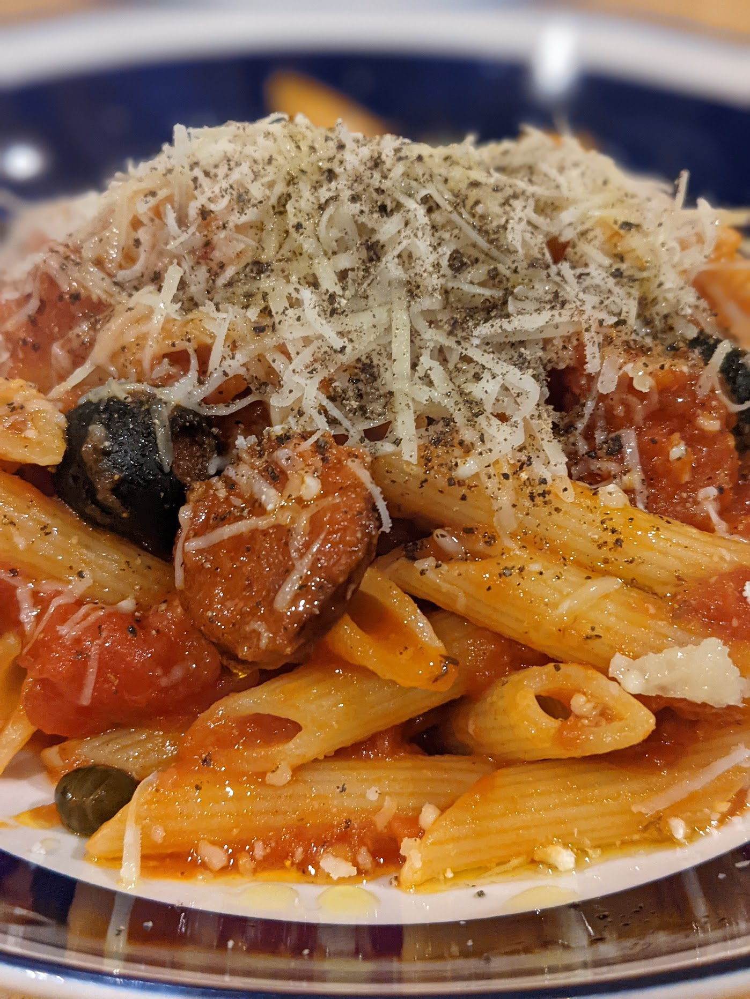

# Magic Pasta

This recipe comes from university days, although I have finessed it and made it far more than just student food since then. The basis of this is a putanesca sauce, which is a traditional italian sauce and probably would be considered a true bastardisation of what Italians consider pasta. Don't worry about that, its delicious.

* 2x400g tins tomatoes, crushed/chopped
* 2-3 Garlic cloves, sliced very finely, or crushed
* 4-6 Anchovices
* 2 tbl spoons Capers
* Excellent glug Olive oil
* half a jar of, Black olives, halved and pithed
* 1 Smoked pork sausage or chorizo sausage (personal favourite). Slice it.
* Grated Parmesan to taste
* 100g per person Guanciale/pancetta/lardons/bacon sliced (order of quality/preference, not all of these.)
* Penne (250g per person)

Note these quantities, in reality are done by eye. I like lots of everything. Other's dont.

### Putanesca

Putanesca sauce is a classic Italian sauce. Firstly in a pan, heat up some olive oil and add the garlic, keep the temperature low but the garlic should begin to turn golden. Add the anchovies and using a wooden spoon aid them in melting with the garlic. 

As the anchovies start to break down, and the garlic and anchovy infuses into a delicious oily paste, add the tomatoes and put on a low temperature. Allow to bubble very gently and infuse together. No need for salt, the anchovy should provide this. Let this thicken up nicely.

### The magic

In another pan, start to cook up the guanciale, no need to add oil, it should provide its own fat. As it starts to cook add the smoked sausage/chorizo. Let it all cook at a low temperature. the sausage is already cooked as part of the smoking so that shouldn't need much more than heating. Get the guanciale to cook nicely, but don't make it too crispy (this isn't Carbonara).

Boil up your penne in another pan. I like al dente.

At this point, the sauce should have started to thicken so you can add the capers and olives, mix together and turn off the heat.

Drain any liquid fat off the guanciale/pork sausage and mix the meat into the sauce. 

Once the pasta is cooked add the sauce to the pasta and serve with grated parmesan and olive oil.

Note do not serve this to an Italian. It is not a classic recipe (bar the Putanesca). It will not be accepted well. 