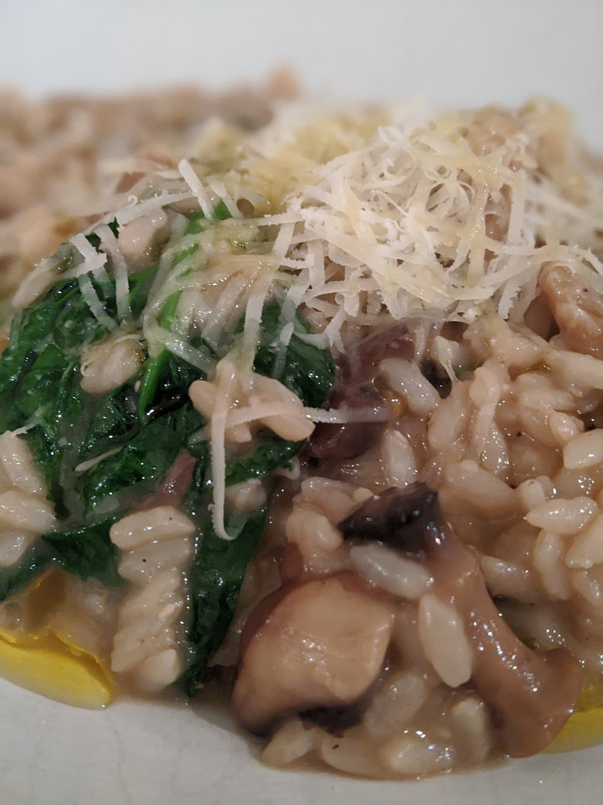

# Mushroom Risotto Instant Pot

* 750ml-1 litre vegetable stock
* 250 g of dried porcini mushrooms (or one pack)
* Olive oil (good glug/2tbsn)
* Good butter
* 1 lb/0.5kg of a range of **nice** mushroooms, chopped
* Sea salt
* Black pepper
* yellow onion
* 2 garlic cloves
* 1 tbsp White miso paste (very optional)
* 500g Arborio rice
* Glass dry white wine
* Parmesan

* Put the dried mushrooms in the stock and leave to sit for a while. 
* Chop these mushrooms. 
* Saute the onion in butter/oil
* Add garlic. 
* Add the fresh mushrooms, and season salt/pepper
* Add the risotto rice and toast until slightly translucent. (At this point, if you wish, add the miso). 
* Add the white wine and stir to allow to slightly boil off. 
* Remove the dried mushrooms from the mushroom stock
* Add stock and submerge the rice. 
* Put lid on and high pressure cook for 6 minutes.
* Rule of thumb, quick release, stir in parmesan and douse with olive oil - however, if you think that its too runny, you can put the lid back on and let it sit for a while to thicken up
