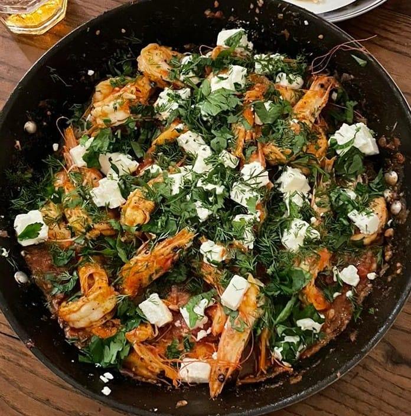
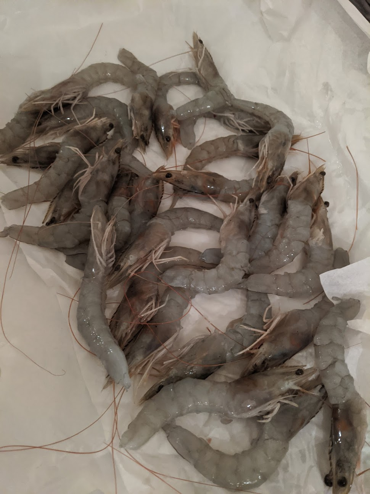
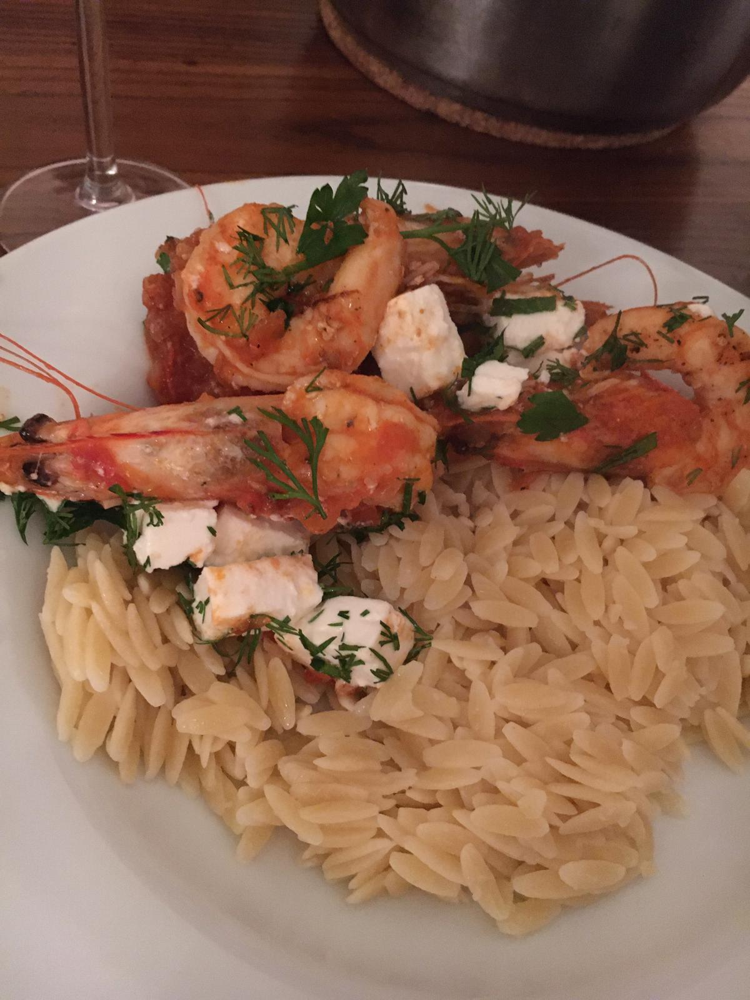

# Prawn Saganaki & Greek Orzo

This dish changed how I think of Greek cooking. Mainland tomato based prawn dish. I like sauce, so there will be a reasonable quantity of sauce in this 
dish.

## Serves 5

* 20-30 large prawns
* 6-8 fresh tomatos
* 2 red onions
* Anchovies (chopped up)
* 3-4 garlic cloves
* Oregano
* Dried chilli flakes (fresh aswell if you want spicier)
* Greek Orzo (150-200g PP depending on what else you are eating)
* Ouzo (Raki will do fine)
* Dill, finely chopped
* Parsley, finely chopped
* Feta (chopped into cubes)
* Olive oil
* Salt/pepper

Deshell the body and tail of the prawns, but make sure to leave the heads attached to the bodies. I tend to do this to all the prawns at once before....
devein all the prawns. Its worth having a large bowl with ice in to keep the prawns fresh during this process. My system is deshell them all, and place them in the ice while I'm going, then once they are all deshelled, take them all out of the bowl, devein each one and put it back in the bowl. 

At this stage you can put the bowl (covered) in the fridge and leave it for a couple of hours (while you prepare everything else).

Chop the tomatoes into very small chunks/cubes/put in a collander for atleast an hour, shaking every so often. Want to remove all the water from the tomatoes. Leave to one side

Very finely chop the red onion and the garlic, cook the onion in a good amount olive oil medium heat, as they start to go soft add the garlic, let it start to go soft aswell add the anchovies. Don't let the anchovies sit to long still, keep the mix moving around and cooking, add salt, pepper and the dried oregano and chilli flakes. This can gently cook on its own but keep an eye on it. 

In a small bowl mix some ground/salt and pepper ready for when you cook the prawns. Prawns cook quickly, so worth having the mix ready.

Add the tomatoes to the onion/garlic/anchovy mix. Make sure to discard all the water that drained off. Mix it up, stick a lid on it, medium to low heat, let that cook away, I give it even up to 20 minutes, but its not an exact science. It will start to taste delicious.

At about this point you want to get the Orzo on, it takes about 7-9 minutes to boil so keep an eye on it while doing the rest. 

In another pan, add a good amount of olive oil and start pan frying the prawns, once you have them laid out, shake some of your pre-mixed salt/pepper over them. They really don't need long (like 30 seconds each side), as they start to go pink, start flipping them over. You don't want rubbery prawns, and remember they are going to get added to the sauce where they will keep cooking in the heat. Flip, add salt/pepper and get them out on to a plate. If you have too many prawns for the pan, do them in two batches.

Once they are out of the pan, pour a medium glass of wine's worth of Ouzo into the prawn pan and deglaize it. Should be reasonably hot when the Ouzo goes in for the deglazing to be effective. Let the alcohol cook off for a minute or two and now add the sauce from before into the pan.

Mix the feta, dill and parlsey into the sauce, well.

Now mix the prawns into the new sauce, be reasonably gentl to not break the heads off the body (looks better, won't effect taste if a couple come off) and serve with the Orzo.

