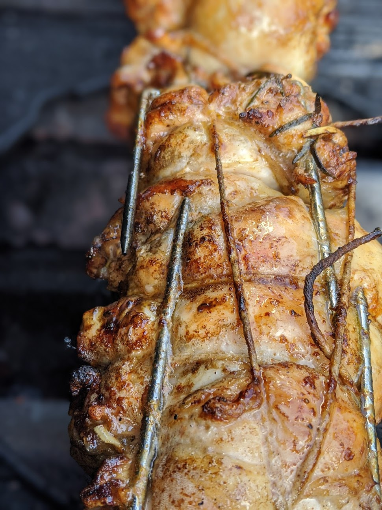
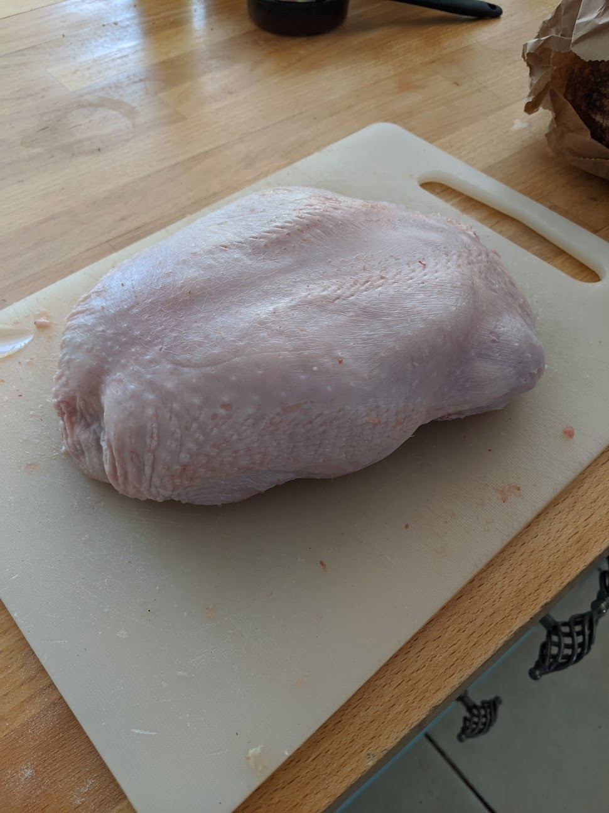
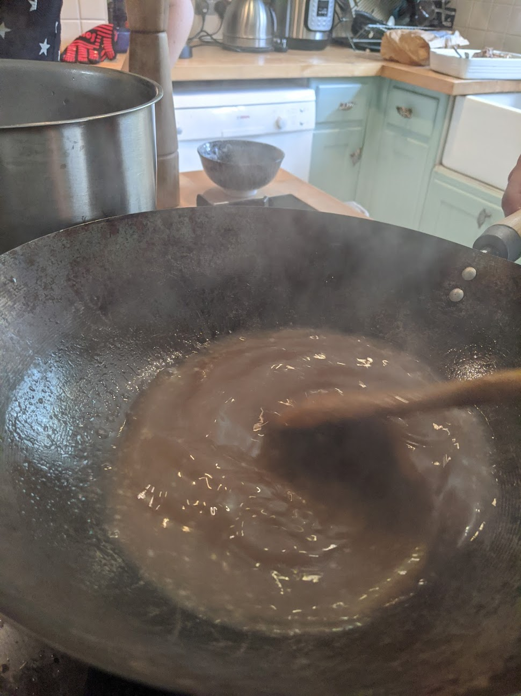

# Rotisserie Chicken and Gravy

* Rotisserie and two sets of claws (one set per chicken)
* 2 chickens
* garlic
* herbs (rosemary etc)
* salt
* pepper
* Olive oil
* paprika
* string
* 1 large white onion
* red wine
* 1 litre chicken stock
* corn flour
* butter

This recipe is to be used in whatever way you see fit.

Debone the two chickens keeping them whole. The better the job, the more intact the skin is, with skill you can remove the bones and keep the chicken in one whole piece. Depending on skill level each chicken will take between 8 and 20 minutes.

lay out the chickens flat, skin side down. Rub the surface with some salt, pepper, olive oil, and paprika and crushed garlic. Remove the rosemary leaves from the stalk and chop them up very finely and sprinkle over the surface. 'Reconstruct' the chicken so that its a sort of roll but try not to overlap the skin on itself.

Once you have done this, you need to do a butcher's knot to hold the chicken into a roll, it needs to be reasonably tight so it doesn't open up but not so tight you are squeezing it all out of the sides. Once you have done both chickens impale one on the rotisserie bar, again trying not to split the skin. push the claws on each end compressing the chicken length ways some what. Do the other. Align them on the bar based on where you are going to cook them over your fire. If your rotisserie has a lid close it and aim for between 180-200 deg C. Use a meat thermometer to check the internal temperature - you want it at 74+ deg C throughout, if its cooking at different temperatures, adjust your heat around the chickens. A tip is to not put the chicken too close to either end of the rotisserie, where it tends to be cooler. Expect it to take around 25-30 minutes but this is a temperature dependent cook, not a time dependent one.

While the chickens are cooking, slice up the onion, add some butter in a big pot with some olive oil, saute the onion. Gather all the bones break up the torso a bit so its flatter, add bay leaf, rosemary, a large chunk of butter, salt and pepper. Keep turning the bones frying them off nicely. Once they are browning nicely add a good glass of red wine and let that simmer for a moment. Now add the stock inwith the whole thing and put a lid on it for a while letting it all cook together.

After about 10 minutes, take the lid off and strain the whole lot through a fine sieve. You can throw away the solids, and return the sauce back to a pan (make sure all the solids are removed if you use the same pan). Mix a teaspoon of cornflouw in a ramekin with some water to make a white very thin paste. Slowly add the cornflour mix to the sauce, allowing the sauce to thicken to your preference. Give the cornflour a couple of minutes to cook out and keep tasting it. Add salt and pepper as you wish. Don't allow it to cook for too long as it will keep thickening and you will lose quantity.

