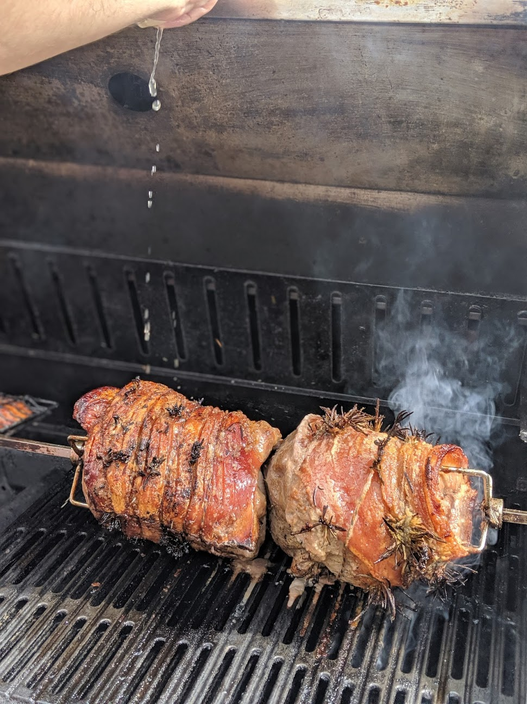
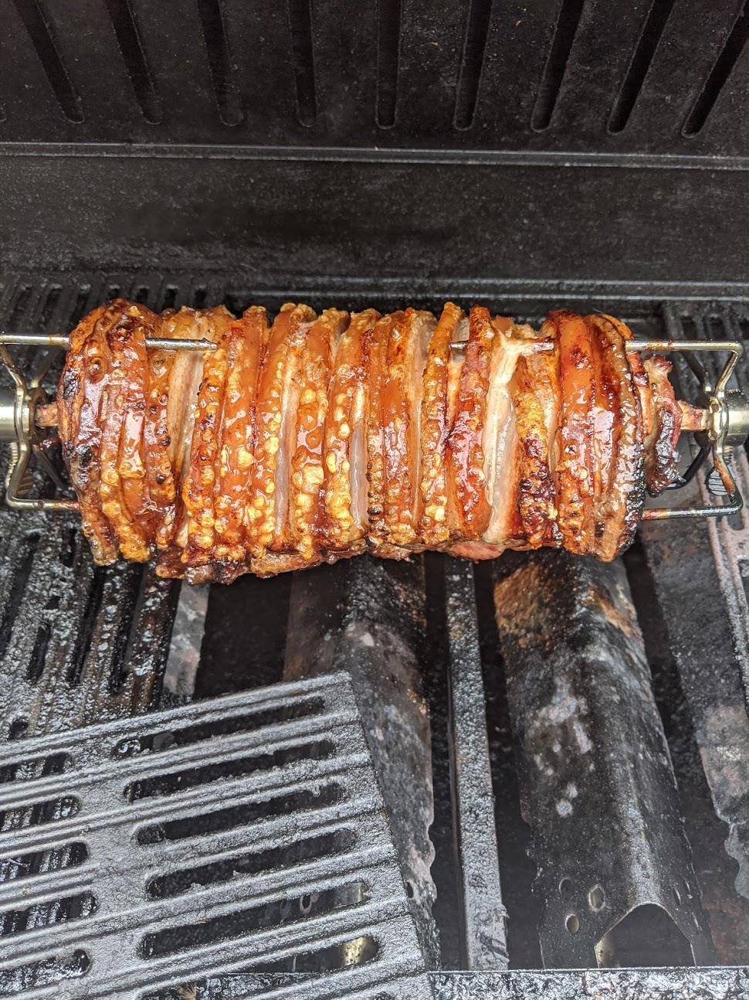

# Rotisserie Pork Belly/Boneless Shoulder

This recipe requires very little (except a rotisserie...) and is absolutely fantastic. So easy to prep and you can do as little or as much as your rotisserie can handle.

## Pork Belly

If you are using a pork belly, firstly, lay flat, score the skin into a chequer pattern. Then place on an oven grill over the sink, skin side up. Pour a full kettle's worth of boiling water over the skin. This will cause the skin to curl up at the score lines. Once you have poured a good amount of boiling water over it, leave it to drip dry for a minute or two and pad dry with kitchen paper. Let dry out for a bit.

## Boneless Pork Shoulder

### Ingredients

* Pork belly/shoulder
* Salt
* Sage
* Rosemary
* water
* Sugard

### Simple

Score the skin in a similar way to the pork belly, and use the boiling water technique. Again, pad dry. If your pork shoulder is already strung, you can unstring if you prefer, but its not essential.

### Advanced

Make up a brine of the sage, rosemary, salt and sugar. Place the shoulder into a ziplock bag and pour the brine in. Try and remove as much air as possible before sealing and place in the fridge for 24 hours. If you have a vacuum former that can handle liquids, use that to seal the shoulder in there.

Making a good brine is a bit of a taste based test. However I like to go for about a litre of water, 100g salt, 50g sugar and a good amount of rosemary and sage. Play around, learn what you prefer.

## Recipe

From now on the recipe is basically the same for both of the above.

On the meat side, or wherever you can access the meat if the shoulder is still strung and you don't want to unstring it (I advise you do), you want to rub salt, pepper garlic powder and rosemary leaves, sage leaves, black pepper.

### Pork Belly

Lie the pork belly skin side down now, cover the meat in the above ingredients as described. Now place the rotisserie skewer down the middle. Its slightly tricky now, but you will need to master a butchers knot and tie to wrap the belly into a cylinder and tie it along the bar. If you get it right the skin will be protecting all the meat. Use two rotisserie skewers to tightly pin the belly into place and secured to the bar. Rub a good amount of salt into the skin and between the crevases where you scored it.

### Pork shoulder

You will want to tie the pork shoulder into a cylinder again as it arrived from your butcher before skwering it. Follow a similar practice of skwering it onto the bar and again, rub salt into the skin. There is far less fat and skin on a pork shoulder, but don't worry too much.

Now you are ready to rotisserie. You want to go quite low and slow with the temperature. I try to keep the air temperature in the rotisserie between 160-180 degrees C max. I also try and avoid direct heat to the meat for atleast an hour to an hour and a half cooking. With pork you want an internal temperature of 74 degrees C. As you cross the 65 degree C line, you can start applying direct heat to start crisping up the skin. If you get the internal temperature up to 70 and the skin isn't crispy yet, concentrate on this for the last part of the cook. 
